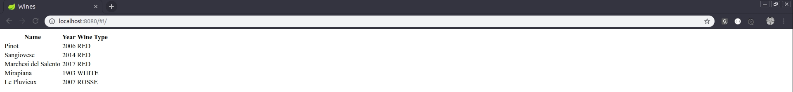
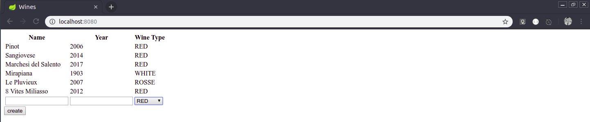
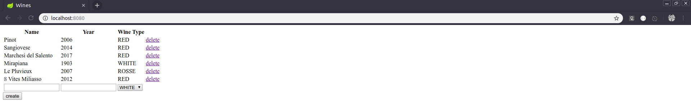
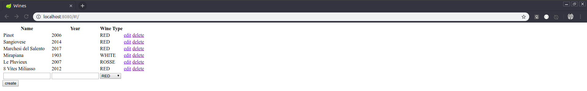
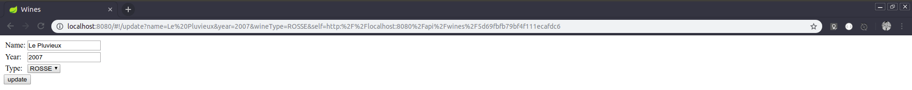
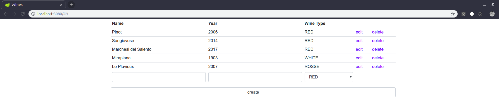
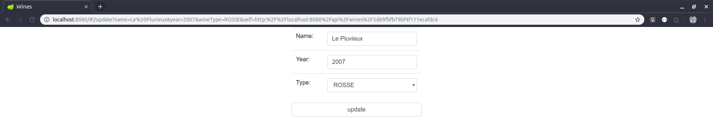

# mongodb-java-angularjs

<br>A project using:
<br>1. MongoDB as your database, inside a docker container. 
<br>2. Java as your back-end language, with spring data. 
<br>3. Angular.js as your front-end framework.
<br>This project will be separeted in 3 parts, respectively.

I am expecting you to have:
<ul>
<li>Access to a terminal.</li>
<li>Docker installed.</li>
<li>Postman installed.</li>
<li>Some IDE from your choice.</li>
</ul>

<h1>MongoDB</h1>
MongoDB is a non-relational dabase, it is a very useful tool but you have to think first if it fits to your necessity. Our choice is made just in order to have contact with the technology. So, shall we begin?

Inside a terminal, pull the lastest image of MongoDB:
> docker pull mongo

Now that you have the image, let's make a container:
> docker run -d -p 27017-27019:27017-27019 --name mongodb -v "/home/padovese/Desktop/github/mongodbfiles:/data/db/" mongo

Ok, so much information here. Let's split it:
<br><b><i>Docker run</i></b> is the command to up a container.
<br><b><i>-d</i></b> stands for detach, it means that your container will be started in background, so you can still use your terminal or even close it.
<br><i><b>-p 27017-27019:27017-27019</i></b> stands for publish list, a list of ports that will be mapped between the conatiner and the host.
<br><i><b>--name mongodb</i></b> That's the name of your container.
<br><i><b>-v "/home/padovese/Desktop/github/mongodbfiles:/data/db/"</i></b> That's the volume list. This is very important, here you are telling to the container to bind some directory inside the container, to a directory inside the host. In practice, it works the same way as a shared folder. The separetor is the character <i><b>":"</i></b>.And obvious, change it to some directory that makes sense from your PC.
<br><i><b>mongo</i></b> the image we just pulled.

To make sure your container is running, you can run this:
> docker ps

You should see something like this:
>> CONTAINER ID        IMAGE               COMMAND                  CREATED             STATUS              PORTS                                  NAMES
<br>85042f73b5b7        mongo               "docker-entrypoint.s…"   3 weeks ago         Up 4 seconds        0.0.0.0:27017-27019->27017-27019/tcp   mongodb

Fine, it is running.
<br>Why are we nothing verifying that's there a MongoDB running inside of this?
<br>Let's dive in the container:
> docker exec -it mongodb bash

This command is basically telling the docker to execute the bash of this container, you should had notice you are not in your host anymore. Something like this appeared:
>> root@85042f73b5b7:/# 

Fine, you can do everything from here, you can explore the container using your usual commands like ls, cd, etc. etc...
<br>To see if MongoDB is installed and running(obviously it is, but whatever), run the command:
> mongo

Then:
>> MongoDB shell version v4.0.11
<br>...

You are now inside the database.

> show dbs;

Then
>> admin   0.000GB
<br>config  0.000GB
<br>local   0.000GB


You are now able to use some database, create some collections(here does not exist tables) or make some queries. But we are not doing it. Well, is better to say that we will let this task to Spring Data handle. 
<br>Just type ctrl c to escape, and after that type exit to come back to your host.

<b>Type:</b> After you restart your PC the container will not start automatically, you can control it with the commands below:
>docker start monogodb
<br>docker stop mongodb

Easiest part of the tutorial, your database is setted.

<h1>Java</h1>
Access: https://start.spring.io/
<br>We will generate the project through this online feature, provide by spring: the initializr.

project: Maven Project
<br><b>Language:</b> Java
<br><b>Spring Boot:</b> 2.1.7 (or higher)
<br><b>Project Metadata:</b> feel free to type.
<br><b>Dependencies:</b> 
<br><b>1.</b> Spring Data MongoDB - This is the responsible to allow java to connect to mongodb, as well as map the data and give us a bunch of useful features.
<br><b>2.</b> Rest Repository - This will expose our spring data repositories as REST services.
<br><b>3.</b> Lombok - This generates automatically getters, setters and constructors.
<br><b>4.</b> Spring Boot DevTools - Provide LiveReload and enhanced our life as a developer.
<br><b>5.</b> Thymeleaf - We will use it just to map our static files correctly.

Generate the project.
<br>Extract it in your worspace folder.
<br>In your IDE, import it as an existing maven project.

You will see a brand new project in your IDE, with the packages setted up, the pom setted up, and an Application class to you start your spring boot application.
<br>This is the beauty of initializr.
___

Now that the set up of our back-end application is done, let's get started.

<b>Our app will be a CRUD that manage wines.</b>
<br>In case you don't know, CRUD stands for a system that have the respective functionalities: Create, Read, Update and Delete.

The first step is to create a class that represent our product, our entity, in this case, a wine:

```java
package com.padovese.crud;

import org.springframework.data.annotation.Id;
import org.springframework.data.mongodb.core.mapping.Document;
import lombok.Data;

@Data
@Document
public class Wine {

    @Id
    private String id;
    private String name;
    private short year;
    private WineType wineType;

}
```
You problaby are swearing me now because your class is not compiling. Let's make it all clear first.

<b>1. </b>The annotation <b><i>@Data</i></b> is from lombok.
<br>Lombok basically generates useful methods for us through the use of annotations. In this case specifically, the <b><i>@Data</i></b> generates a public constuctor with no field, a public construction with all fields, getters and setters, beside other things.
<br>To work properly, you should have the lombok in your pom.xml(we already got it because of the initializr), and you need to set up your IDE in order to it understand the use of lombok and do not face it as an error.
<br>It's very easy, please visit their site, choose install, find your IDE and follow the steps: https://projectlombok.org/

<b>2. </b> The annotation <b><i>@Document</b></i> is from spring data.
<br>Here you are telling to spring that this is a document that have to be stored in MongoDB as an document. Remember, in mongo tables does not exist, mongo has documents instead.

<b>3. </b> The annotation <b><i>@Id</b></i> is from spring data as well. It says that this field will be an unique ID on database. At mongo, ids are no a sequencial number, they are like more a hash value, this is why it is a String.

<b>4. </b> <b><i>WineType</b></i> is the reason why your class is not compiling. To solve this, we have to create the WineType, but it is not gonna be a class, it is gonna be an ENUM:
```java
package com.padovese.crud;

public enum WineType {
    RED, WHITE, ROSSE;
}
```
First step done.
___

Now we shall create an interface that is actually a repository for our wine class:  
```java
package com.padovese.crud;

import org.springframework.data.mongodb.repository.MongoRepository;

public interface WineRepository extends MongoRepository<Wine, String>{
}
```
<i><b>MongoRepository</b></i> is an implemention that already give us useful methods for our repository, like findOne, findAll, deleteOne, etc...
<br>It uses generics, and in the diamond operator the first object is your class, and the second one is the type of your id.

That's it. You have your back-end done.
<br>Don't believe it? Open postman and make some calls:

First let's create a wine in our system.
To create, we shall use the HTTP verb <b><i>post</b></i>:

Verb and end-point:
>POST http://localhost:8080/wines/

Header:
```
Content-Type: application/json
```
Body:
```json
{
  "name": "Merlot",
  "year": 2012,
  "wineType": "RED"
}
```

Send it. If everything is fine, the response should be something like this:
> Status: 201 Created
```json
{
  "name": "Merlot",
  "year": 2012,
  "wineType": "RED",
  "_links": {
    "self": {
      "href": "http://localhost:8080/wines/5d6c6ec9a802da44f1c4998b"
    },
    "wine": {
      "href": "http://localhost:8080/wines/5d6c6ec9a802da44f1c4998b"
    }
  }
}
```

Now let's query the results of our repository. To list every wine we have, we shall use the HTTP verb <b><i>get</b></i>:
Verb and end-point
>GET http://localhost:8080/wines/

Send it. The response should be something like this:
> Status: 200 OK
```json
{
  "_embedded": {
    "wines": [
      {
        "name": "Merlot",
        "year": 2012,
        "wineType": "RED",
        "_links": {
          "self": {
            "href": "http://localhost:8080/wines/5d6c6ec9a802da44f1c4998b"
          },
          "wine": {
            "href": "http://localhost:8080/wines/5d6c6ec9a802da44f1c4998b"
          }
        }
      }
    ]
  },
  "_links": {
    "self": {
      "href": "http://localhost:8080/wines{?page,size,sort}",
      "templated": true
    },
    "profile": {
      "href": "http://localhost:8080/profile/wines"
    }
  },
  "page": {
    "size": 20,
    "totalElements": 1,
    "totalPages": 1,
    "number": 0
  }
}
```

To update the data of some wine we shall use the HTTP verb <b><i>put</b></i>:
>PUT http://localhost:8080/wines/5d6c6ec9a802da44f1c4998b

Header:
```
Content-Type: application/json
```
Body:
```json
{
  "name": "Merlot",
  "year": 2016,
  "wineType": "WHITE"
}
```
Send it. The response should be something like this:
> Status: 200 OK
```json
{
  "name": "Merlot",
  "year": 2012,
  "wineType": "WHITE",
  "_links": {
    "self": {
      "href": "http://localhost:8080/api/wines/5d6c6ec9a802da44f1c4998b"
    },
    "wine": {
      "href": "http://localhost:8080/api/wines/5d6c6ec9a802da44f1c4998b"
    }
  }
}
```

To delete some wine we will use the HTTP verb<b><i>delete</b></i>:
>DELETE http://localhost:8080/wines/f87df865f68d5fd8f5

Send it. The response should be something like this:
> Status: 204 No Content
```json
(no body)
```

And this way, as you saw, we already have our CRUD done. At least the back-end.
To practice and to prepare some data, I will ask you to register 5 different wines of your wish in your database.

___

Before we move on to front-end part let's create a controller to return our home.html
```java
package com.padovese.crud;

import org.springframework.stereotype.Controller;
import org.springframework.web.bind.annotation.GetMapping;

@Controller
public class HomeController {

    @GetMapping("/")
    public String home() {
        return "home";
    }
    
}
```
<b>1. </b>The annotation <b><i>@Controller</i></b> is from spring MVC. It defines this class a component of spring, a controller.<br>
<b>2. </b>The annotation <b><i>@GetMapping("/")</i></b> is from spring as well. It sets this method as responsible for resolve any request made to your apllication using the verb <b><i>get</i></b> and with this suffix "/" in its end-point.

We will return the String "home". Spring is smart enough to seek the file in src/main/resources/templates/home.html when this method is called. Thymeleaf helps spring with some patterns, appending the .html and mapping it all to the templates folder.

To finish, we do not want to our APIs be mapping to root "/" of our project, because it can conflict with the angular controllers. Open the file src\main\resources\application.properties and write it down:
>spring.data.rest.base-path=/api

Now to make some request for our wine system you have to call it this way:
>http://localhost:8080/api/wines/

<h1>Angular.js</h1>
Our system is working, we just need to code a decent interface and it's done.
Let's create two files:


>/crud/src/main/resources/static/app.js
```javascript
let wineApp = angular.module('wineApp', []);

wineApp.controller('crudController', function () {
});
```
Here we are setting up our angular app, and defining our first <i>controller</i>.

>/crud/src/main/resources/templates/home.html
```html
<!DOCTYPE html>
<html lang="en" ng-app="wineApp">

<head>
	<meta charset="UTF-8">
	<title>Wines</title>
	<script src="https://ajax.googleapis.com/ajax/libs/angularjs/1.7.8/angular.min.js"></script>
	<script src="app.js"></script>
</head>

<body>
	<div ng-controller="crudController">
	</div>
</body>
</html>
```
Here we are creating a basic HTML file, importing the angular.min.js, setting the <i>ng-app</i> attribute to our entire page and importing the angular <i>controller</i>.

Now, in your IDE, run your Application.java as a java application and access http://localhost:8080/
<br>You should see a white screen.

___

<h2>The Read Feature</h2>
The HTTP verb equivalent to <b><i>read</i></b> is <b><i>get</i></b>. So let's inject the http service into our angular controller, so we can make request of any kind.

>/crud/src/main/resources/static/app.js
```javascript
let wineApp = angular.module('wineApp', []);

wineApp.controller('crudController', function ($scope, $http) {

	$http.get('/api/wines').then(
		function (result) {
			$scope.wines = result.data._embedded.wines;
		}, function (data, status) {
			console.log(data, status);
		});

});
```
First of all, we injected http service and the scope though. Scope is basically an object that keep your values, and you can bind it to your HTML elements.<br>
Http will help us to make requests, in this case a <b><i>get</i></b>. The first function is the success case, and the second one is the error case. So, if we have success making this call we will set the <b><i>$scope.wines</i></b> the value of our JSON <b><i>result.data._embedded.wines</i></b>. In case of error, we will do nothing but showing the data and the status in the console.

>/crud/src/main/resources/templates/home.html
```html
<!DOCTYPE html>
<html lang="en" ng-app="wineApp">

<head>
	<meta charset="UTF-8">
	<title>Wines</title>
	<script src="https://ajax.googleapis.com/ajax/libs/angularjs/1.7.8/angular.min.js"></script>
	<script src="app.js"></script>
</head>

<body>
	<div ng-controller="crudController">
        <table>
            <tr>
                <th>Name</th>
                <th>Year</th>
                <th>Wine Type</th>
            </tr>

            <tr ng-repeat="wine in wines">
                <td>{{ wine.name }}</td>
                <td>{{ wine.year }}</td>
                <td>{{ wine.wineType }}</td>
            </tr>
        </table>
	</div>
</body>
</html>
```
We created a table, and we are using here a tool for loop through our data, as we received a list of wines, the command: <b><i>ng-repeat</i></b>.<br> It will repeat this block of code once for each element in the wines list. Remember, we got this list as soon as we enter in the page, because we code the <b><i>$http.get</i></b> function in the body of our controller, and we are assign it results in the <b><i>$scope.wine</i></b> variable.

Our output so far:<br>


___

<h2>The Create Feature</h2>
The HTTP verb equivalent to <b><i>create</i></b> is <b><i>post</i></b>. In this case, makes sense start from the HTML.

>/crud/src/main/resources/templates/home.html
```html
<!DOCTYPE html>
<html lang="en" ng-app="wineApp">

<head>
	<meta charset="UTF-8">
	<title>Wines</title>
	<script src="https://ajax.googleapis.com/ajax/libs/angularjs/1.7.8/angular.min.js"></script>
	<script src="app.js"></script>
</head>

<body>
	<div ng-controller="crudController">
        <table>
            <tr>
                <th>Name</th>
                <th>Year</th>
                <th>Wine Type</th>
            </tr>

            <tr ng-repeat="wine in wines">
                <td>{{ wine.name }}</td>
                <td>{{ wine.year }}</td>
                <td>{{ wine.wineType }}</td>
            </tr>

            <tr>
                <td><input type="text" ng-model="name"></td>
                <td><input type="number" ng-model="year"></td>
                <td>
                    <select ng-model="wineType">
                        <option value="RED">RED</option>
                        <option value="WHITE">WHITE</option>
                        <option value="ROSSE">ROSSE</option>
                    </select>
                </td>
            </tr>
        </table>
        <button ng-click="setWine()">create</button>
	</div>
</body>
</html>
```
We are adding another row in our table. We have now a text field, a number field, and a combo field. Pay attention to the <b><i>ng-model="myAttribute"</i></b> attribute, with it we can get or pass valor to angular through the <b><i>$scope.myAttribute</i></b>.
<br>After the table, now we have a button with the <b><i>ng-click</i></b> attribute. With it we can call a function in our angular app, since this time we will make the <b><i>post</i></b> request only when the button is clicked and not when the screen loads.

>/crud/src/main/resources/static/app.js
```javascript
let wineApp = angular.module('wineApp', []);

wineApp.controller('crudController', function ($scope, $http) {
    $scope.name = '';
	$scope.year = '';
	$scope.wineType = 'RED';

	$http.get('/api/wines').then(
		function (result) {
			$scope.wines = result.data._embedded.wines;
		}, function (data, status) {
			console.log(data, status);
		});

    $scope.setWine = function () {
		$http.post('/api/wines', { name: $scope.name, year: $scope.year, wineType: $scope.wineType }).then(
			function (result) {
				$scope.name = '';
				$scope.year = '';
				$scope.wines.push(result.data);
			}, function (data, status) {
				console.log(data, status);
			});
	}
});
```
First we are initializing the scope variables name, year and wineType to match our HTML ng-model attributes.
<br>Then we are creating the function setWine(). It take no parameters, it actually call the <b><i>$http.post</i></b> function using our <b><i>$scope</i></b> variable as parameters instead. Remember, in angular when a ng-model changes on the browser the  <b><i>$scope</i></b> see the diferente immediately. The vice-versa works as well.
<br>In our success case, we clear the name and year variables and we push the new brand wine to our wines list. Take a look and see that angular refresh it contents on the screen as soon as the response kicks in, we do not need to refresh the page. These are some of the benefits of angular.

Create some new wines to test your application.
<br>Our output so far:<br>

___

<h2>The Delete Feature</h2>
We already have our structure coded, and the logic to implement the delete is very similar to the create feature. Let's start it editing our table adding a new column. 

>/crud/src/main/resources/templates/home.html
```html
<!DOCTYPE html>
<html lang="en" ng-app="wineApp">

<head>
	<meta charset="UTF-8">
	<title>Wines</title>
	<script src="https://ajax.googleapis.com/ajax/libs/angularjs/1.7.8/angular.min.js"></script>
	<script src="app.js"></script>
</head>

<body>
	<div ng-controller="crudController">
        <table>
            <tr>
                <th>Name</th>
                <th>Year</th>
                <th>Wine Type</th>
                <th></th>
            </tr>

            <tr ng-repeat="wine in wines">
                <td>{{ wine.name }}</td>
                <td>{{ wine.year }}</td>
                <td>{{ wine.wineType }}</td>
                <td><a href ng-click="deleteWine(wine._links.self.href, $index)">delete</a></td>
            </tr>

            <tr>
                <td><input type="text" ng-model="name"></td>
                <td><input type="number" ng-model="year"></td>
                <td>
                    <select ng-model="wineType">
                        <option value="RED">RED</option>
                        <option value="WHITE">WHITE</option>
                        <option value="ROSSE">ROSSE</option>
                    </select>
                </td>
                <td></td>
            </tr>
        </table>
        <button ng-click="setWine()">create</button>
	</div>
</body>
</html>
```
The secret is the <b><i>ng-click</i></b> and the function again. This time we must pass 2 parameters:
<br>- The self link to the wine, provided by the back-end in our first "Read Feature".
<br>- The index. Index is the self position from a loop condition. In this case it will basically tell us which row we are clicking, and it will be necessary to delete this register after all.

>/crud/src/main/resources/static/app.js
```javascript
let wineApp = angular.module('wineApp', []);

wineApp.controller('crudController', function ($scope, $http) {
    $scope.name = '';
	$scope.year = '';
	$scope.wineType = 'RED';

	$http.get('/api/wines').then(
		function (result) {
			$scope.wines = result.data._embedded.wines;
		}, function (data, status) {
			console.log(data, status);
		});

    $scope.setWine = function () {
		$http.post('/api/wines', { name: $scope.name, year: $scope.year, wineType: $scope.wineType }).then(
			function (result) {
				$scope.name = '';
				$scope.year = '';
				$scope.wines.push(result.data);
			}, function (data, status) {
				console.log(data, status);
			});
	}

    $scope.deleteWine = function (endPoint, i) {
		$http.delete(endPoint).then(
			function (result) {
				$scope.wines.splice(i, 1);
			}, function (data, result) {
				console.log(data, status);
			});
	}
});
```
That <b><i>deleteWine</i></b> function should be easy to you understand right now. It calls the <b><i>$http.delete</i></b> function and pass the wine's end-point as a parameter, and it's done.
<br>In our success case, we will use the splice function in our wines list to remove that register. As you already know, angular will see that this element doesn't exist anymore and the HTML table will reflect it immediately.

Our output so far:<br>


___

<h2>The Update Feature</h2>
The HTTP verb equivalent to <b><i>update</i></b> is <b><i>put</i></b>. In this case, makes sense start from the HTML.
<br>We are going to make a structural change right now, because to update some register we will have to enter in a new page to edit it. Let's implement the SPA(Single Page Application) concept and angular will handle it for us.

To handle it, we must use the ngRouter API from angular into our app. Then we will config the routes and after that we will create our update functionality.
<br>You will see a lot of new code, don't worry it will be explained.

>/crud/src/main/resources/static/app.js
```javascript
let wineApp = angular.module('wineApp', ['ngRoute']);

wineApp.config(function ($routeProvider) {
	$routeProvider
		.when("/", {
			templateUrl: 'crudContent.html',
			controller: 'crudController'
		})

		.when("/update", {
			templateUrl: 'updateContent.html',
			controller: 'crudController'
		})
});

wineApp.controller('updateController', function ($scope, $routeParams, $http, $window){
	$scope.name = $routeParams.name;
	$scope.year = Number($routeParams.year);
	$scope.wineType = $routeParams.wineType;
	$scope.self = $routeParams.self;

	$scope.update = function(self){
		$http.put(self, { name: $scope.name, year: $scope.year, wineType: $scope.wineType }).then(
			function (result) {
				alert('Update sucessful');
				$window.location.href = '/';
			}, function (data, status) {
				console.log(data, status);
			});
	}
});

wineApp.controller('crudController', function ($scope, $http) {
    $scope.name = '';
	$scope.year = '';
	$scope.wineType = 'RED';

	$http.get('/api/wines').then(
		function (result) {
			$scope.wines = result.data._embedded.wines;
		}, function (data, status) {
			console.log(data, status);
		});

    $scope.setWine = function () {
		$http.post('/api/wines', { name: $scope.name, year: $scope.year, wineType: $scope.wineType }).then(
			function (result) {
				$scope.name = '';
				$scope.year = '';
				$scope.wines.push(result.data);
			}, function (data, status) {
				console.log(data, status);
			});
	}

    $scope.deleteWine = function (endPoint, i) {
		$http.delete(endPoint).then(
			function (result) {
				$scope.wines.splice(i, 1);
			}, function (data, result) {
				console.log(data, status);
			});
	}
});
```
<b>1. </b>We tell angular that we want to use ngRoute API declaring it in our first line of code: <i><b>['ngRoute']</b></i>.<br>
<b>2. </b>Our <i><b>wineApp.config</b></i> is the key to the SPA. Here we let <i><b>$routeProvider</b></i> handle it for us. We need to refactor our HTML to keep this straight, but it's very easy to get. When we call some end-point, like "/update", angular will replace the content of the page with the HTML template specified, and call a controller to take care of its logic.<br>
<b>3. </b>The creation of our updateController. Here we inject two new services: 
- <i><b>$routeParams</b></i>, the responsible for let us get the parameters from a requisition. We will need to inform this controller who will be updated, so this is necessary.
- <i><b>$window</b></i>, the responsible for redirect the user to the first page after we update the wine.

First thing to do is associate the <i><b>$routeParams</b></i> to <i><b>$scope</b></i> variables.
<br>Then, we will crate a function to update the data, similar to the old ones.

It's time to refactor our HTML. Create two new files:
>/crud/src/main/resources/static/crudContent.html
```html
<div ng-controller="crudController">
        <table>
            <tr>
                <th>Name</th>
                <th>Year</th>
                <th>Wine Type</th>
                <th></th>
                <th></th>
            </tr>

            <tr ng-repeat="wine in wines">
                <td>{{ wine.name }}</td>
                <td>{{ wine.year }}</td>
                <td>{{ wine.wineType }}</td>
                <td><a href="#!/update?name={{wine.name}}&year={{wine.year}}&wineType={{wine.wineType}}&self={{wine._links.self.href}}"> edit</a></td>
                <td><a href ng-click="deleteWine(wine._links.self.href, $index)">delete</a></td>
            </tr>

            <tr>
                <td><input type="text" ng-model="name"></td>
                <td><input type="number" ng-model="year"></td>
                <td>
                    <select ng-model="wineType">
                        <option value="RED">RED</option>
                        <option value="WHITE">WHITE</option>
                        <option value="ROSSE">ROSSE</option>
                    </select>
                </td>
                <td></td>
                <td></td>
            </tr>
        </table>
        <button ng-click="setWine()">create</button>
	</div>
```
Yes, this is a copy and paste from your index.html
<br>We are only adding a new column and a link to update the wine.

>/crud/src/main/resources/static/updateContent.html
```html
<div ng-controller="updateController">
    <table>
        <tr>
            <td>Name:</td>
            <td><input type="text" ng-model="name"></td>
        </tr>
        <tr>
            <td>Year:</td>
            <td><input type="number" ng-model="year"></td>
        </tr>
        <tr>
            <td>Type:</td>
            <td><select ng-model="wineType">
                    <option value="RED">RED</option>
                    <option value="WHITE">WHITE</option>
                    <option value="ROSSE">ROSSE</option>
                </select></td>
        </tr>
    </table>
    <button ng-click="update(self)">update</button>
</div>
```
This form follows the same idea, we have the <i><b>ng-model</b></i> that binds our <i><b>$scope</b></i> variables, and we have a <i><b>ng-click</b></i> to invoke our function.

>/crud/src/main/resources/templates/home.html
```html
<!DOCTYPE html>
<html lang="en" ng-app="wineApp">

<head>
	<meta charset="UTF-8">
	<title>Wines</title>
	<script src="https://ajax.googleapis.com/ajax/libs/angularjs/1.7.8/angular.min.js"></script>
    <script src="https://ajax.googleapis.com/ajax/libs/angularjs/1.7.8/angular-route.js"></script>
	<script src="app.js"></script>
</head>

<body>
	<div ng-view></div>
</body>
</html>
```
First of all we should import here angular-route.js to use it.
<br>Since we separeted the content, we can now use the <i><b>ng-view</b></i>. This div will have our content from now on, and it will be replaced when the content from other routes eventually.
<br>This is all the logic our index.html should have.

Our output so far:<br>



___

Our system is working as we wish, but before we finish, let's add some bootstrap style to it and make the visual way better.

>/crud/src/main/resources/templates/home.html
```html
<!DOCTYPE html>
<html lang="en" ng-app="wineApp">

<head>
	<meta charset="UTF-8">
	<title>Wines</title>
    <link href="https://stackpath.bootstrapcdn.com/bootstrap/4.3.1/css/bootstrap.min.css" rel="stylesheet" integrity="sha384-ggOyR0iXCbMQv3Xipma34MD+dH/1fQ784/j6cY/iJTQUOhcWr7x9JvoRxT2MZw1T" crossorigin="anonymous">
</head>

<body>
	<div class="container">
		<div ng-view></div>
	</div>

    <script src="https://ajax.googleapis.com/ajax/libs/angularjs/1.7.8/angular.min.js"></script>
    <script src="https://ajax.googleapis.com/ajax/libs/angularjs/1.7.8/angular-route.js"></script>
	<script src="app.js"></script>
    <script src="https://stackpath.bootstrapcdn.com/bootstrap/4.3.1/js/bootstrap.min.js" integrity="sha384-JjSmVgyd0p3pXB1rRibZUAYoIIy6OrQ6VrjIEaFf/nJGzIxFDsf4x0xIM+B07jRM" crossorigin="anonymous"></script>
</body>

</html>
```
Here in the index.html we are importing bootstrap's css and js. Also, let's put our <i><b>ng-view</b></i> inside a div with the container class.

>/crud/src/main/resources/static/crudContent.html
```html
<div class="col-sm" ng-controller="crudController">
    <table class="table table-sm">
        <tr>
            <th>Name</th>
            <th>Year</th>
            <th>Wine Type</th>
            <th></th>
            <th></th>
        </tr>

        <tr ng-repeat="wine in wines">
            <td>{{ wine.name }}</td>
            <td>{{ wine.year }}</td>
            <td>{{ wine.wineType }}</td>
            <td><a href="#!/update?name={{wine.name}}&year={{wine.year}}&wineType={{wine.wineType}}&self={{wine._links.self.href}}"> edit</a></td>
            <td><a href ng-click="deleteWine(wine._links.self.href, $index)">delete</a></td>
        </tr>

        <tr>
            <td><input type="text" class="form-control" ng-model="name"></td>
            <td><input type="number" class="form-control" ng-model="year"></td>
            <td>
                <select class="form-control" ng-model="wineType">
                    <option value="RED">RED</option>
                    <option value="WHITE">WHITE</option>
                    <option value="ROSSE">ROSSE</option>
                </select>
            </td>
            <td></td>
            <td></td>
        </tr>
    </table>
    <button class="form-control" ng-click="setWine()">create</button>
</div>
```
Since the templates will be rendered inside our index.html, you can use the bootstrap classes over here as well.

>/crud/src/main/resources/static/updateContent.html
```html
<div class="row">
    <div class="col-4"></div>
    <div class="col-4" ng-controller="updateController">
        <table class="table">
            <tr>
                <td>Name:</td>
                <td><input type="text" class="form-control" ng-model="name"></td>
            </tr>
            <tr>
                <td>Year:</td>
                <td><input type="number" class="form-control" ng-model="year"></td>
            </tr>
            <tr>
                <td>Type:</td>
                <td><select class="form-control" ng-model="wineType">
                        <option value="RED">RED</option>
                        <option value="WHITE">WHITE</option>
                        <option value="ROSSE">ROSSE</option>
                    </select></td>
            </tr>
        </table>
        <button class="form-control" ng-click="update(self)">update</button>
    </div>
</div>
```

Our final product:<br>

